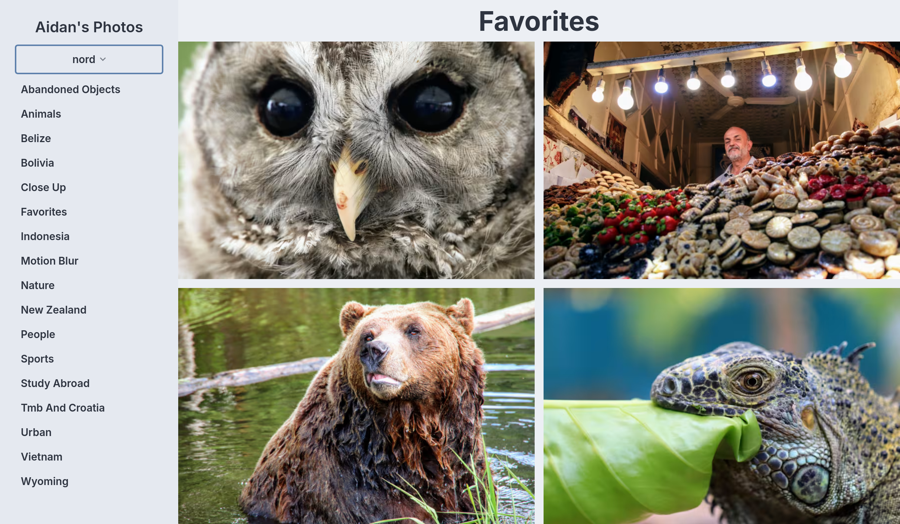
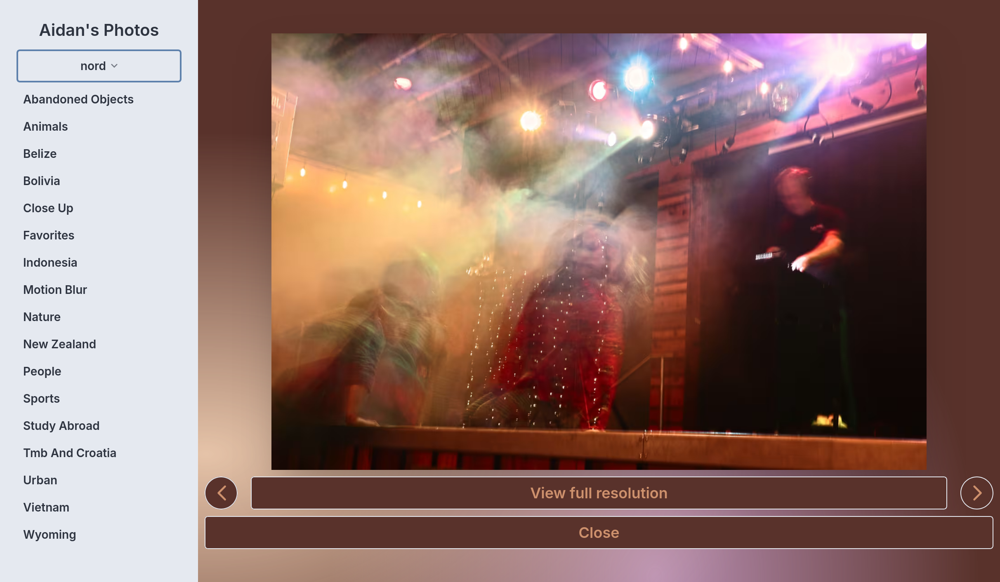

# Aidan's Photos

A responsive gallery for photographs I have taken while traveling and at home.

[View the live site](https://photos.aidang.me/)



The site organizes several hundred photographs by place and subject, including people, wildlife, landscapes, cities, and motion. Each category has its own shareable gallery, and every photograph opens into a focused full-screen view.

## Features

- Responsive masonry galleries for photographs with different aspect ratios
- Browsing by location, subject, or a curated favorites collection
- Dedicated photo URLs with previous and next navigation
- Background colors and gradients generated from each photograph's palette
- Light and dark themes
- Open Graph metadata for category and individual-photo links
- Installable PWA with cached application assets



## Image delivery

The original photographs are hosted on Cloudinary. The application derives smaller 720px and 1440px variants in AVIF and WebP, allowing the browser to choose an efficient format while retaining access to the full-resolution original. Images are loaded lazily, and category data is generated from a typed, curated photo index.

## Code highlights

- [`src/lib/photos.ts`](src/lib/photos.ts) — photo metadata, category indexing, ranking, and Cloudinary transformations
- [`src/lib/components/PhotoPicture.svelte`](src/lib/components/PhotoPicture.svelte) — responsive AVIF/WebP image rendering
- [`src/lib/components/SvelteMasonry.svelte`](src/lib/components/SvelteMasonry.svelte) — gallery layout
- [`src/routes/[category]/[index]/+page.svelte`](src/routes/[category]/[index]/+page.svelte) — palette-aware individual photo view
- [`vite.config.ts`](vite.config.ts) — SvelteKit, Tailwind, and PWA configuration

## Built with

Svelte 5, SvelteKit, TypeScript, Tailwind CSS, DaisyUI, Cloudinary, Color Thief, and Vite PWA.

## Development

```sh
bun install
bun run dev
```

Before building:

```sh
bun run lint
bun run check
bun run build
```

All photographs displayed by the application are my own.
